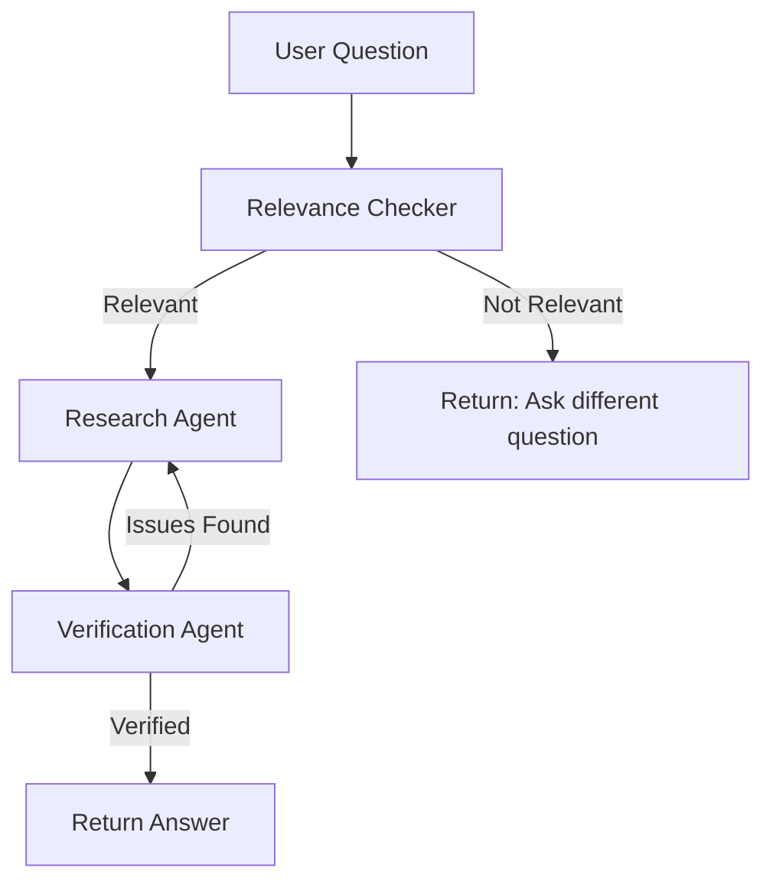

# DocChat 🐥

A multi-agent RAG (Retrieval-Augmented Generation) system powered by **Google Gemini**, **Docling**, and **LangGraph** for intelligent document Q&A with built-in fact-checking and hallucination prevention.

## 🌟 Why DocChat?

Sure, you could use ChatGPT or other LLMs to answer questions about your documents, but when dealing with **long documents containing multiple tables, images, and dense text**, these models struggle with:

- ❌ **Retrieval accuracy** - Missing key information buried in footnotes or tables
- ❌ **Hallucinations** - Fabricating citations or making up information
- ❌ **Table misinterpretation** - Incorrectly reading numerical data
- ❌ **Context limitations** - Unable to process entire documents

**DocChat solves these problems** through a multi-agent verification system that ensures every answer is grounded in your documents.

## 🚀 Key Features

### Multi-Agent Architecture
- **🔍 Relevance Checker** - Validates if documents contain information to answer your question
- **📚 Research Agent** - Analyzes retrieved content and generates initial responses
- **✅ Verification Agent** - Cross-checks responses against original documents to detect hallucinations
- **🔄 Self-Correction** - Automatically re-runs research if contradictions or unsupported claims are found

### Hybrid Retrieval System
- **BM25 Keyword Search** - Finds exact matches and specific terminology
- **Vector Embeddings** - Captures semantic meaning and context
- **Ensemble Retriever** - Intelligently combines both approaches for optimal results

### Advanced Document Processing
- **Powered by Docling** - IBM's state-of-the-art document parser
- **OCR Support** - Handles scanned documents and images
- **Multiple Formats** - PDF, DOCX, TXT, Markdown
- **Smart Caching** - Avoids reprocessing unchanged documents

### User-Friendly Interface
- **Gradio Web UI** - Clean, intuitive interface
- **Example Documents** - Pre-loaded examples to get started
- **Real-time Verification** - See fact-checking results alongside answers

## 📋 Table of Contents

- [Installation](#installation)
- [Quick Start](#quick-start)
- [Project Structure](#project-structure)
- [Configuration](#configuration)
- [Usage](#usage)
- [How It Works](#how-it-works)
- [API Keys](#api-keys)
- [Examples](#examples)
- [Troubleshooting](#troubleshooting)
- [Contributing](#contributing)
- [License](#license)

## 🛠️ Installation

### Prerequisites
- Python 3.9 or higher
- Google API Key ([Get one here](https://makersuite.google.com/app/apikey))

### Step 1: Clone the Repository
```bash
git clone https://github.com/sheraztariq22/DocChat-MultiAgent.git
cd DocChat-MultiAgent
```

### Step 2: Create Virtual Environment
```bash
python -m venv venv

# On Windows
venv\Scripts\activate

# On macOS/Linux
source venv/bin/activate
```

### Step 3: Install Dependencies
```bash
pip install -r requirements.txt
```

### Step 4: Set Up Environment Variables
Create a `.env` file in the project root:
```env
GOOGLE_API_KEY=your_google_api_key_here
```

## 🚀 Quick Start

### Run the Application
```bash
python app.py
```

The application will start at `http://127.0.0.1:5000`

### Using the Web Interface

1. **Upload Documents** - Click "📄 Upload Documents" and select your files
2. **Ask a Question** - Type your question in the "❓ Question" box
3. **Submit** - Click "Submit 🚀"
4. **Review Results** - See the answer and verification report

### Try an Example

1. Select an example from the dropdown menu
2. Click "Load Example 🛠️"
3. Click "Submit 🚀"

## 📁 Project Structure

```
DOCCHAT-MULTI-AGENT/
├── agents/
│   ├── __init__.py
│   ├── relevance_checker.py    # Checks if documents can answer the question
│   ├── research_agent.py       # Generates initial answers
│   ├── verification_agent.py   # Fact-checks answers
│   └── workflow.py             # LangGraph workflow orchestration
├── config/
│   ├── __init__.py
│   ├── constants.py            # File size and type constants
│   └── settings.py             # Configuration settings
├── document_processor/
│   ├── __init__.py
│   └── file_handler.py         # Document parsing and caching
├── retriever/
│   ├── __init__.py
│   └── builder.py              # Hybrid retriever builder
├── utils/
│   ├── __init__.py
│   └── logging.py              # Logging configuration
├── examples/                   # Example documents
├── test/                       # Test files
├── document_cache/             # Cached processed documents
├── chroma_db/                  # Vector database storage
├── app.py                      # Main Gradio application
├── requirements.txt            # Python dependencies
├── .env                        # Environment variables (create this)
├── .gitignore
└── README.md
```

## ⚙️ Configuration

### Environment Variables (`.env`)
```env
# Required
GOOGLE_API_KEY=your_google_api_key_here

# Optional (defaults in settings.py)
CHROMA_DB_PATH=./chroma_db
CHROMA_COLLECTION_NAME=documents
VECTOR_SEARCH_K=10
LOG_LEVEL=INFO
CACHE_DIR=document_cache
CACHE_EXPIRE_DAYS=7
```

### File Constraints (`config/constants.py`)
```python
MAX_FILE_SIZE = 50 MB        # Maximum single file size
MAX_TOTAL_SIZE = 200 MB      # Maximum total upload size
ALLOWED_TYPES = [".txt", ".pdf", ".docx", ".md"]
```

### Retrieval Settings (`config/settings.py`)
```python
VECTOR_SEARCH_K = 10         # Number of documents to retrieve
HYBRID_RETRIEVER_WEIGHTS = [0.4, 0.6]  # [BM25, Vector]
```

## 📖 Usage

### Command Line Interface
```python
from document_processor.file_handler import DocumentProcessor
from retriever.builder import RetrieverBuilder
from agents.workflow import AgentWorkflow

# Initialize components
processor = DocumentProcessor()
retriever_builder = RetrieverBuilder()
workflow = AgentWorkflow()

# Process documents
chunks = processor.process(uploaded_files)
retriever = retriever_builder.build_hybrid_retriever(chunks)

# Ask a question
result = workflow.full_pipeline(
    question="What is the main topic?",
    retriever=retriever
)

print(result["draft_answer"])
print(result["verification_report"])
```

### Supported File Types
- **PDF** - Including scanned documents (OCR)
- **DOCX** - Microsoft Word documents
- **TXT** - Plain text files
- **MD** - Markdown files

## 🧠 How It Works

### 1. Document Processing
```
Upload → Docling Parser → Markdown → Text Splitter → Chunks
```
- Documents are converted to Markdown format
- Split by headers (#, ##, ###)
- Cached to avoid reprocessing

### 2. Hybrid Retrieval
```
Question → [BM25 Search + Vector Search] → Ranked Results
```
- **BM25**: Keyword-based retrieval for exact matches
- **Vector**: Semantic search using Gemini embeddings
- **Ensemble**: Weighted combination (40% BM25, 60% Vector)

### 3. Multi-Agent Workflow



**Step-by-step:**
1. **Relevance Check** - Determines if documents contain relevant information
2. **Research** - Generates initial answer from retrieved passages
3. **Verification** - Checks for:
   - Factual support in documents
   - Unsupported claims
   - Contradictions
   - Relevance to the question
4. **Self-Correction** - Re-runs research if issues detected

## 🔑 API Keys

### Get Your Google API Key

1. Visit [Google AI Studio](https://makersuite.google.com/app/apikey)
2. Click "Create API Key"
3. Copy the key
4. Add to `.env` file:
   ```env
   GOOGLE_API_KEY=your_api_key_here
   ```

### Rate Limits (Free Tier)
- **Gemini Pro**: 60 requests/minute
- **Embeddings**: 1,500 requests/day

For higher limits, consider [upgrading](https://ai.google.dev/pricing).

## 📚 Examples

### Example 1: Google Environmental Report
**Question:** "Retrieve the data center PUE efficiency values in Singapore 2nd facility in 2019 and 2022."

**Documents:** `examples/google-2024-environmental-report.pdf`

### Example 2: DeepSeek Technical Report
**Question:** "Summarize DeepSeek-R1 model's performance evaluation on all coding tasks against OpenAI o1-mini model"

**Documents:** `examples/DeepSeek Technical Report.pdf`

## 🐛 Troubleshooting

### Common Issues

**1. "Module not found" errors**
```bash
pip install -r requirements.txt
```

**2. "Invalid API key"**
- Check your `.env` file
- Ensure `GOOGLE_API_KEY` is set correctly
- Verify the key at [Google AI Studio](https://makersuite.google.com/app/apikey)

**3. "Failed to process file"**
- Check file format (PDF, DOCX, TXT, MD only)
- Ensure file size < 50 MB
- For scanned PDFs, OCR processing may take longer

**4. "Chroma database error"**
```bash
rm -rf chroma_db/
# Restart the application
```

**5. Cache issues**
```bash
rm -rf document_cache/
# Documents will be reprocessed
```

### Enable Debug Logging
In `.env`:
```env
LOG_LEVEL=DEBUG
```
1. **Update `.env`:**
   GOOGLE_API_KEY=your_google_api_key_here
   ```

2. **Install new dependencies:**
   ```bash
   pip install -r requirements.txt
   ```

3. **Clear caches:**
   ```bash
   rm -rf chroma_db/ document_cache/
   ```

## 🤝 Contributing

Contributions are welcome! Please follow these steps:

1. Fork the repository
2. Create a feature branch (`git checkout -b feature/AmazingFeature`)
3. Commit your changes (`git commit -m 'Add some AmazingFeature'`)
4. Push to the branch (`git push origin feature/AmazingFeature`)
5. Open a Pull Request

## 📝 License

This project is licensed under the MIT License - see the [LICENSE](LICENSE) file for details.

## 🙏 Acknowledgments

- **[Docling](https://github.com/DS4SD/docling)** - Advanced document parsing by IBM Research
- **[LangGraph](https://github.com/langchain-ai/langgraph)** - Agent workflow orchestration
- **[Google Gemini](https://ai.google.dev/)** - LLM and embeddings
- **[Gradio](https://gradio.app/)** - Web interface framework
- **[ChromaDB](https://www.trychroma.com/)** - Vector database

## 📧 Contact

For questions or support, please open an issue on GitHub.

---

**Built with ❤️ using Google Gemini, Docling, and LangGraph**

🐥 Happy document chatting!